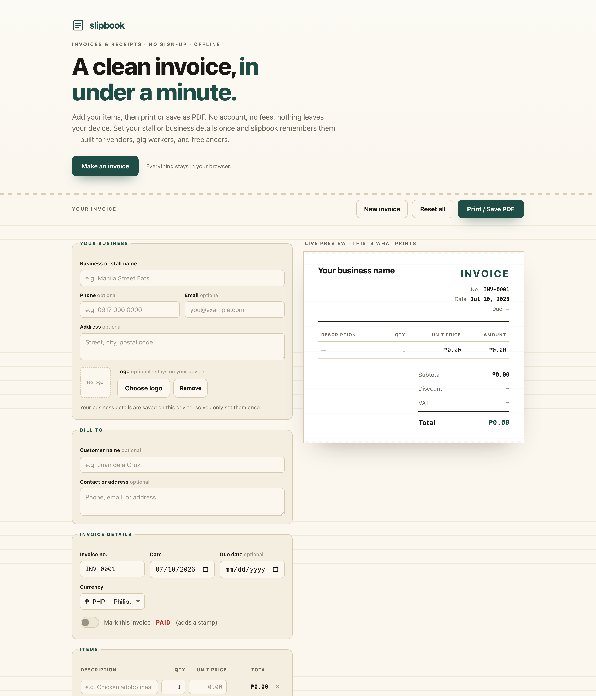

# slipbook

**A clean invoice or receipt in under a minute.** Add your items, then print or save as PDF. No account, no fees, nothing leaves your device. 100% client-side, zero dependencies, works fully offline.

## Why

Most invoice apps make a street vendor, gig worker, or freelancer sign up, start a subscription, or hand over their customers' details to a server just to produce a single piece of paper. That is a lot of friction for something that should take a minute.

slipbook does the one job and nothing else: you set your stall or business details once, add your line items, and a clean invoice document builds itself as you type. When it looks right, you print it or save it as a PDF. There is no account to create, nothing to pay, and none of your business or customer data ever leaves your browser.

## Features

- **Reusable business profile** — set your business/stall name, phone, email, address, and an optional logo once; slipbook remembers it on your device for every future invoice.
- **Line items with live totals** — add and remove rows of description, quantity, and unit price; each line total and the running subtotal update as you type.
- **Tax and discount** — an editable tax/VAT rate with an editable label (VAT, GST, Sales tax…), plus a discount as a percentage or a fixed amount. Everything is rounded correctly to two decimals.
- **Multiple currencies** — ₱ PHP, $ USD, ₹ INR, £ GBP, € EUR, $ AUD, and a generic option; all amounts use tabular mono figures like a real till receipt.
- **Invoice meta done for you** — auto-suggested invoice numbers that increment when you start a new invoice, today's date filled in, an optional due date, and a notes/terms field.
- **Live preview that is the print output** — the invoice document you see is exactly what prints; a dedicated print stylesheet hides the editor so the page comes out tidy on A4 or Letter.
- **Optional PAID stamp** — a clean, honest stamp for cash receipts.
- **100% offline** — no accounts, no network calls, no tracking.

## Quickstart

Just open `index.html` in any modern browser — no build step, no server, no install.

- **Local:** double-click `index.html`, or run a static server in the folder.
- **Hosted:** **[Open slipbook live](https://sreenivas-sadhu-prabhakara.github.io/slipbook/)**

To save your invoice as a PDF, click **Print / Save PDF** and choose **Save as PDF** as the destination in your browser's print dialog.

## Privacy

slipbook is built so you can trust it with money and customer details.

- A strict Content-Security-Policy sets `connect-src 'none'`: the app **cannot** make any network request even if it tried — that is enforced by the browser, not just promised.
- A logo you add stays local: it is read into a `data:` URL and kept in your browser's local storage, never uploaded anywhere.
- No external fonts, scripts, images, or analytics. Everything is self-contained.
- Because there are no network dependencies, it works with **no internet at all** — load it once and it keeps working offline.

## Disclaimer

slipbook is a document tool, not accounting, tax, or legal advice. You are responsible for using the correct tax rates and for legal compliance in your own jurisdiction. This software is provided under the MIT License, "as is", without warranty of any kind; the authors accept no liability for any loss or damage arising from its use.

## License

[MIT](./LICENSE) © 2026 Sreenivas Sadhu Prabhakara
